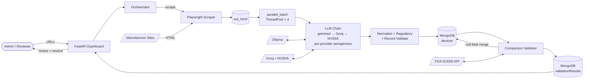

# Fivos - Medical Device Data Harvesting & Validation

A multi-agent AI system that automates the process of checking medical device data between manufacturer websites and the FDA's GUDID database.

Built by **Vibe Coders** for [Fivos](https://www.fivoshealth.com) as a senior design project (CIS 497).

## The Problem

The FDA maintains a database called GUDID (Global Unique Device Identification Database) that is supposed to be the single source of truth for medical device information. In practice, the data in GUDID often does not match what manufacturers have on their own websites. Things like wrong dimensions, outdated brand names, or mismatched model numbers can cause real problems with patient records and equipment ordering.

This project automates most of that verification work.

## How It Works

**Collect → Compare → Correct**

**The Harvester** crawls manufacturer websites using Playwright and extracts device specs using an 8-model LLM fallback chain (gemma4 local → Groq → NVIDIA NIM → Ollama fallback). Extracted records are stored in MongoDB.

**The Validator** compares harvested records against the FDA's GUDID API — model numbers, catalog numbers, brand names, company names, and description similarity.

**The Review Dashboard** shows discrepancies side-by-side so human reviewers can pick the correct value for each mismatched field.

### Flow Diagram



See [`docs/Fivos - Data Flow Diagram.md`](docs/Fivos%20-%20Data%20Flow%20Diagram.md) for the full end-to-end DFD with auth, logging, and phase boundaries.

## Tech Stack

| Layer | Tools |
|---|---|
| Language | Python 3.13.7 |
| Web Scraping | Playwright (async, headless Chromium) |
| AI / LLM | Groq + NVIDIA NIM (cloud) → Ollama (local fallback) |
| Database | MongoDB |
| Web UI | FastAPI + Jinja2 |
| Auth | bcrypt + HIBP breach check |

## Project Structure

```
├── app/                    # FastAPI web dashboard
│   ├── routes/             # dashboard, harvester, validate, gudid, review, auth, admin
│   ├── services/           # auth_service, auth_guard, user_service
│   ├── templates/          # Jinja2 HTML templates
│   └── static/             # CSS + JS (password.js)
├── harvester/src/
│   ├── pipeline/           # runner, llm_extractor, parallel_batch, parser, emitter, cli
│   ├── web_scraper/        # Playwright browser automation
│   ├── normalizers/        # text, model numbers, dates, units, booleans
│   ├── validators/         # GUDID client, comparison, record validation
│   ├── database/           # MongoDB connection
│   └── security/           # sanitization, credentials
└── docs/superpowers/specs/ # Design specs
```

## Getting Started

### Prerequisites

- Python 3.13.7, MongoDB, `bcrypt` (`pip install bcrypt`)
- Groq API key (free: console.groq.com) and/or NVIDIA NIM key (build.nvidia.com)
- Ollama with `gemma4` (primary), `qwen2.5:7b`, and `mistral`

### Installation

```bash
git clone <repo> && cd fivos-project
python3.13 -m venv venv && source venv/bin/activate
pip install -r requirements.txt && playwright install
cp .env.example .env   # add FIVOS_MONGO_URI, GROQ_API_KEY, NVIDIA_API_KEY, AUTH_SECRET_KEY
```

### Docker Setup (Recommended for Handoff)

Run the entire stack — FastAPI app, MongoDB, and GPU-accelerated Ollama with all three models — with one command.

#### Prerequisites

1. **Docker Engine 19.03+** with Docker Compose v2
2. **NVIDIA GPU** (tested on RTX 4070) + NVIDIA drivers installed on the host
3. **NVIDIA Container Toolkit** — required for GPU passthrough:

   ```bash
   curl -fsSL https://nvidia.github.io/libnvidia-container/gpgkey | \
     sudo gpg --dearmor -o /usr/share/keyrings/nvidia-container-toolkit-keyring.gpg
   curl -s -L https://nvidia.github.io/libnvidia-container/stable/deb/nvidia-container-toolkit.list | \
     sed 's#deb https://#deb [signed-by=/usr/share/keyrings/nvidia-container-toolkit-keyring.gpg] https://#g' | \
     sudo tee /etc/apt/sources.list.d/nvidia-container-toolkit.list
   sudo apt-get update && sudo apt-get install -y nvidia-container-toolkit
   sudo nvidia-ctk runtime configure --runtime=docker
   sudo systemctl restart docker
   ```

   Verify: `docker run --rm --gpus all nvidia/cuda:12.2.0-base-ubuntu22.04 nvidia-smi`

#### First-Time Setup

```bash
cp .env.example .env
# Edit .env: set GROQ_API_KEY, NVIDIA_API_KEY, AUTH_SECRET_KEY
# FIVOS_MONGO_URI in .env is ignored — compose overrides to mongodb://mongo:27017/fivos
docker compose up
```

**First run takes 15-25 minutes** — the `ollama-init` sidecar downloads three models totaling ~17 GB (`gemma4:latest`, `qwen2.5:7b`, `mistral`). Watch the `ollama-init-1` logs for progress. Models are saved to a named volume, so subsequent runs take under 30 seconds.

When you see `Server running at http://localhost:8000` in the `app-1` logs, open the dashboard in your browser.

#### Common Commands

| Command | Purpose |
|---|---|
| `docker compose up` | Start everything (foreground) |
| `docker compose up -d` | Start in background |
| `docker compose logs -f app` | Tail the FastAPI logs |
| `docker compose logs -f ollama-init` | Watch the model download on first run |
| `docker compose down` | Stop everything (keeps volumes) |
| `docker compose down -v` | Stop and wipe all volumes (re-downloads models on next up) |
| `docker compose exec app bash` | Shell into the app container |
| `docker compose build --no-cache` | Force full rebuild of the app image |

#### Architecture

- **`app`** — FastAPI dashboard + harvester pipeline, port 8000
- **`mongo`** — MongoDB 7, port 27017, persisted to `mongo_data` volume
- **`ollama`** — Ollama server with GPU passthrough, port 11434, models in `ollama_models` volume
- **`ollama-init`** — one-shot container that pulls the three required models on first run

#### Handoff Verification

Run these checks on the deployment host (e.g., the Oracle Cloud GPU VM) after `docker compose up` reports `Server running at http://localhost:8000`. This confirms the full stack is healthy end-to-end.

**1. GPU passthrough is working**

```bash
docker run --rm --gpus all nvidia/cuda:12.2.0-base-ubuntu22.04 nvidia-smi
```

Expected: prints the `nvidia-smi` table showing the provisioned GPU. If it fails with `nvidia-container-cli: initialization error`, the NVIDIA Container Toolkit isn't installed or the host has no GPU drivers — see Prerequisites above.

**2. All three Ollama models downloaded**

```bash
docker compose exec app python -c "
import os, requests
url = os.getenv('OLLAMA_URL', '').replace('/api/chat', '/api/tags')
r = requests.get(url)
print([m['name'] for m in r.json().get('models', [])])
"
```

Expected: `['gemma4:latest', 'qwen2.5:7b', 'mistral:latest']` (the suffix on `mistral` may vary). If any model is missing, the `ollama-init` sidecar didn't finish — check `docker compose logs ollama-init`.

**3. App container can reach MongoDB**

```bash
docker compose exec app python -c "
from harvester.src.database.db_connection import get_db
db = get_db()
print('collections:', db.list_collection_names())
print('mongo ok')
"
```

Expected: prints `collections: ['users']` (seeded by the FastAPI lifespan on startup) and `mongo ok`.

**4. Web dashboard responds**

```bash
curl -sI http://localhost:8000/auth/login
```

Expected: `HTTP/1.1 200 OK` with `content-type: text/html`.

**5. End-to-end harvest works**

In a browser, open `http://<host>:8000/auth/login`. Log in as `admin@fivos.local` / `admin123` — you'll be forced to set a new password on first login (the seeded password is in HIBP). Once logged in, go to `/harvester`, submit a single test manufacturer URL, and wait for the progress to complete. Then verify a device was written:

```bash
docker compose exec app python -c "
from harvester.src.database.db_connection import get_db
print('device count:', get_db().devices.count_documents({}))
"
```

Expected: `device count` is ≥ 1.

**6. Warm-start performance**

```bash
docker compose down   # keeps volumes
docker compose up
```

Expected: `ollama-init` completes in <5 seconds (models already cached in the `ollama_models` volume), total startup from `docker compose up` to `Server running at http://localhost:8000` is under 30 seconds. If it re-downloads models, the volume isn't persisting — check `docker volume ls` for `fivos_senior_project_ollama_models`.

If all six checks pass, the stack is healthy and ready for use.

#### Environment Variables

- `UVICORN_RELOAD` — set to `true` (case-insensitive) to enable Uvicorn auto-reload for local dev. Defaults to `false` (disabled) so containers run stable without filesystem-watch restart loops. Only the literal string `true` enables it — `1`, `yes`, and `on` do NOT.

#### Troubleshooting

**`docker compose up` fails with "could not select device driver ... nvidia"**
→ NVIDIA Container Toolkit not installed. See Prerequisites above.

**`nvidia-container-cli: initialization error: WSL environment detected but no adapters were found`**
→ On WSL2, ensure NVIDIA drivers are installed on the Windows host (not inside WSL) and Docker Desktop WSL2 integration is enabled for your distro. Verify with `nvidia-smi` from Windows PowerShell first.

**`ollama-init` hangs or errors during `ollama pull`**
→ Check internet connectivity and disk space (need ~20 GB free for models). Re-run `docker compose up ollama-init` to resume the download.

**`app` crashes with "connection refused" to mongo**
→ Mongo healthcheck hasn't passed yet. The `depends_on: condition: service_healthy` should prevent this; if it persists, check `docker compose logs mongo` for errors.

**Port conflict on 8000 / 27017 / 11434**
→ Something on the host is already using that port. Either stop the conflicting process or edit the `ports:` mappings in `docker-compose.yml`.

### Running the Dashboard

```bash
uvicorn app.main:app --port 8000 --reload
# Open http://localhost:8000
```

On first start, demo accounts are seeded into MongoDB with `force_password_change: true`. Log in with `admin@fivos.local / admin123` — you'll be prompted to set a new password immediately (HIBP blocks reuse of `admin123`).

### Dashboard Pages

| Page | Route | Who |
|---|---|---|
| Dashboard | `/` | All |
| Harvester | `/harvester` | Admin |
| Validator | `/validate` | Admin |
| GUDID Lookup | `/gudid` | All |
| Review | `/review/<id>` | Admin, Reviewer |
| User Management | `/admin/users` | Admin only |

### Running the Pipeline (CLI)

```bash
python harvester/src/pipeline/cli.py                                    # interactive menu
python harvester/src/pipeline/runner.py --urls harvester/src/urls.txt   # full pipeline
python harvester/src/pipeline/runner.py --urls ... --no-validate         # harvest only
python harvester/src/pipeline/runner.py --urls ... --overwrite           # overwrite DB
```

### Running Tests

```bash
pytest        # all tests
pytest -v     # verbose
```

## Key Features

- LLM-powered extraction with 8-model fallback chain (gemma4 → Groq → NVIDIA → Ollama)
- Parallel batch extraction (4 workers) with per-provider concurrency caps and non-blocking fall-through — ~6× faster than sequential on 28-URL runs
- Two-pass extraction: page-level fields + product table rows (one record per SKU)
- 15 fields extracted per device including regulatory compliance (NRL, OTC, sterilization, deviceKit, 510k numbers)
- GUDID fallback merge: null harvested fields auto-filled from GUDID post-validation
- Comparison against FDA GUDID with per-field match scoring
- Human review dashboard: side-by-side field comparison, pick correct values
- MongoDB-backed auth with bcrypt (work factor 12) and HIBP k-anonymity breach check
- Admin account management: create accounts, set roles, disable/enable users
- Forced password change on first login for all new/seeded accounts

## Team

| Name | Role |
|---|---|
| Wyatt Ladner | Developer |
| Jason Sonith | Developer |
| Ryan Tucker | Developer |
| Ralph Mouawad | Developer |
| Jonathan Gammill | Developer |

**Client:** Doug Greene — doug.greene@fivoshealth.com
