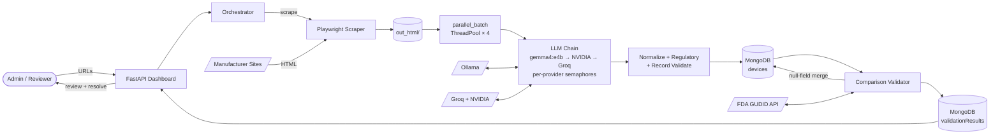

# Fivos - Medical Device Data Harvesting & Validation

A multi-agent AI system that automates the process of checking medical device data between manufacturer websites and the FDA's GUDID database.

Built by **Vibe Coders** for [Fivos](https://www.fivoshealth.com) as a senior design project (CIS 497).

## The Problem

The FDA maintains a database called GUDID (Global Unique Device Identification Database) that is supposed to be the single source of truth for medical device information. In practice, the data in GUDID often does not match what manufacturers have on their own websites. Things like wrong dimensions, outdated brand names, or mismatched model numbers can cause real problems with patient records and equipment ordering.

This project automates most of that verification work.

## How It Works

**Collect → Compare → Correct**

**The Harvester** crawls manufacturer websites using Playwright and extracts device specs using a 5-model LLM fallback chain (local gemma4:e4b primary → NVIDIA NIM → Groq). Extracted records are stored in MongoDB.

**The Validator** compares harvested records against the FDA's GUDID API — model numbers, catalog numbers, brand names, company names, and description similarity.

**The Review Dashboard** shows discrepancies side-by-side so human reviewers can pick the correct value for each mismatched field.

### Flow Diagram



See [`docs/Fivos - Data Flow Diagram.md`](docs/Fivos%20-%20Data%20Flow%20Diagram.md) for the full end-to-end DFD with auth, logging, and phase boundaries.

## Tech Stack

| Layer | Tools |
|---|---|
| Language | Python 3.13.7 |
| Web Scraping | Playwright (async, headless Chromium) |
| AI / LLM | Groq + NVIDIA NIM (cloud) → Ollama (local fallback) |
| Database | MongoDB |
| Web UI | FastAPI + Jinja2 |
| Auth | bcrypt + HIBP breach check |

## Project Structure

```
├── app/                    # FastAPI web dashboard
│   ├── routes/             # dashboard, harvester, validate, gudid, review, auth, admin
│   ├── services/           # auth_service, auth_guard, user_service
│   ├── templates/          # Jinja2 HTML templates
│   └── static/             # CSS + JS (password.js)
├── harvester/src/
│   ├── pipeline/           # runner, llm_extractor, parallel_batch, parser, emitter, cli
│   ├── web_scraper/        # Playwright browser automation
│   ├── normalizers/        # text, model numbers, dates, units, booleans
│   ├── validators/         # GUDID client, comparison, record validation
│   ├── database/           # MongoDB connection
│   └── security/           # sanitization, credentials
└── docs/superpowers/specs/ # Design specs
```

## Getting Started

### Client Install (Docker)

Everything needed — Python, Playwright, Ollama, MongoDB, a small local LLM — comes with the Docker image. `docker compose up` (run from the `docker/` subfolder) boots the whole stack on any laptop (Mac, Windows, Linux) with no GPU required.

#### Prerequisites

1. **Docker Desktop** (Mac / Windows) or Docker Engine + Compose v2 (Linux).
   Install from https://www.docker.com/products/docker-desktop/.
2. **~8 GB free disk space** — image layers, MongoDB volume, one small local model.
3. **Internet for first run** — downloads the image + a ~2 GB local LLM.

#### Steps

1. Clone the repo (or unzip the bundle Jason sent) and `cd` into it.
2. Copy the `.env` file Jason emailed into the project root (not into `docker/`).
3. In a terminal, change into the `docker/` folder and start the stack:
   ```bash
   cd docker
   docker compose up
   ```
   First run takes ~5–10 minutes (image build + local model pull). After that, starts in seconds.
4. Open http://localhost:8000 in your browser.
5. Log in with **admin@fivos.local / admin123** — you'll be forced to set a new password.
6. Open the **Harvester** page. In the **Batch Upload** tab, upload `sample_urls.txt` (included in the project root). Wait ~2 minutes.
7. The Dashboard now shows harvested devices and validation results. Click any "Partial Match" or "Mismatch" row to review discrepancies field-by-field.

#### Common Commands

Run these from the `docker/` folder (`cd docker` first). To run them from anywhere else, add `-f docker/docker-compose.yml` after `docker compose`.

| Command | Purpose |
|---|---|
| `docker compose up` | Start everything (foreground) |
| `docker compose up -d` | Start in background |
| `docker compose logs -f app` | Tail the FastAPI logs |
| `docker compose logs -f ollama-init` | Watch the model download on first run |
| `docker compose down` | Stop everything (keeps volumes and cached models) |
| `docker compose down -v` | Stop and wipe all volumes (re-downloads model next time) |
| `docker compose exec app bash` | Shell into the app container |
| `docker compose build --no-cache` | Force full rebuild of the app image |

#### Services

- **`app`** — FastAPI dashboard + harvester pipeline, port 8000
- **`mongo`** — MongoDB 7, localhost-only port 27017, persisted to `mongo_data` volume
- **`ollama`** — Ollama server (CPU), localhost-only port 11434, model in `ollama_models` volume
- **`ollama-init`** — one-shot container that pulls `gemma4:e4b` on first run

Local `gemma4:e4b` is the primary extractor. Cloud LLMs (Groq, NVIDIA NIM) absorb overflow when the Ollama semaphore is saturated and serve as full fallback when the local model fails.

#### Environment Variables

- `GROQ_API_KEY`, `NVIDIA_API_KEY` — cloud LLM keys. Delivered out of band by Jason for the client install.
- `MONGO_USERNAME`, `MONGO_PASSWORD` — database auth. `MONGO_PASSWORD` must be set; compose fails fast otherwise.
- `AUTH_SECRET_KEY` — FastAPI session cookie secret. Any 32+ character random string.
- `UVICORN_RELOAD` — set to the literal string `true` (case-insensitive) for dev auto-reload. Default `false`. `1`, `yes`, and `on` do NOT work.

#### Troubleshooting

**Port conflict on 8000 / 27017 / 11434** — something on the host already uses that port. Stop the conflicting process or edit the `ports:` mappings in `docker/docker-compose.yml`.

**`app` crashes with "connection refused" to mongo** — the mongo healthcheck hasn't passed yet. `depends_on: condition: service_healthy` normally prevents this; if it persists, check `docker compose logs mongo`.

**`ollama-init` hangs on `ollama pull`** — the Ollama CDN is unreachable. Check internet connectivity. If you're on a corporate network that blocks Docker Hub or Ollama, ask your network admin to whitelist `registry.ollama.ai` and `hub.docker.com`.

**Extraction always fails with "all models disabled"** — both cloud keys are wrong/missing and the local fallback can't load. Check `docker compose logs app` for the specific error; confirm `GROQ_API_KEY` and `NVIDIA_API_KEY` in your `.env` are non-empty.

#### For Developers (optional GPU + local-venv workflow)

The stack above is CPU-only by default. If you have an NVIDIA GPU and the NVIDIA Container Toolkit installed, add the GPU override:

```bash
cd docker
docker compose -f docker-compose.yml -f docker-compose.gpu.yml up
```

For non-Docker dev (local Python / hot-reload):

```bash
python3.13 -m venv venv && source venv/bin/activate
pip install -r requirements.txt && playwright install
cp .env.example .env   # fill in FIVOS_MONGO_URI, GROQ_API_KEY, NVIDIA_API_KEY, AUTH_SECRET_KEY
uvicorn app.main:app --port 8000 --reload
# or run the CLI directly:
python harvester/src/pipeline/cli.py
```

### Dashboard Pages

| Page | Route | Who |
|---|---|---|
| Dashboard | `/` | All |
| Harvester | `/harvester` | Admin |
| Validator | `/validate` | Admin |
| GUDID Lookup | `/gudid` | All |
| Review | `/review/<id>` | Admin, Reviewer |
| User Management | `/admin/users` | Admin only |

### Running the Pipeline (CLI)

```bash
python harvester/src/pipeline/cli.py                                    # interactive menu
python harvester/src/pipeline/runner.py --urls harvester/src/urls.txt   # full pipeline
python harvester/src/pipeline/runner.py --urls ... --no-validate         # harvest only
python harvester/src/pipeline/runner.py --urls ... --overwrite           # overwrite DB
```

### Running Tests

```bash
pytest        # all tests
pytest -v     # verbose
```

## Key Features

- LLM-powered extraction with 5-model fallback chain (local gemma4:e4b primary → NVIDIA → Groq)
- Parallel batch extraction (4 workers) with per-provider concurrency caps and non-blocking fall-through — ~6× faster than sequential on 28-URL runs
- Two-pass extraction: page-level fields + product table rows (one record per SKU)
- 15 fields extracted per device including regulatory compliance (NRL, OTC, sterilization, deviceKit, 510k numbers)
- GUDID fallback merge: null harvested fields auto-filled from GUDID post-validation
- Comparison against FDA GUDID with per-field match scoring
- Human review dashboard: side-by-side field comparison, pick correct values
- MongoDB-backed auth with bcrypt (work factor 12) and HIBP k-anonymity breach check
- Admin account management: create accounts, set roles, disable/enable users
- Forced password change on first login for all new/seeded accounts

## Team

| Name | Role |
|---|---|
| Wyatt Ladner | Developer |
| Jason Sonith | Developer |
| Ryan Tucker | Developer |
| Ralph Mouawad | Developer |
| Jonathan Gammill | Developer |

**Client:** Doug Greene — doug.greene@fivoshealth.com
