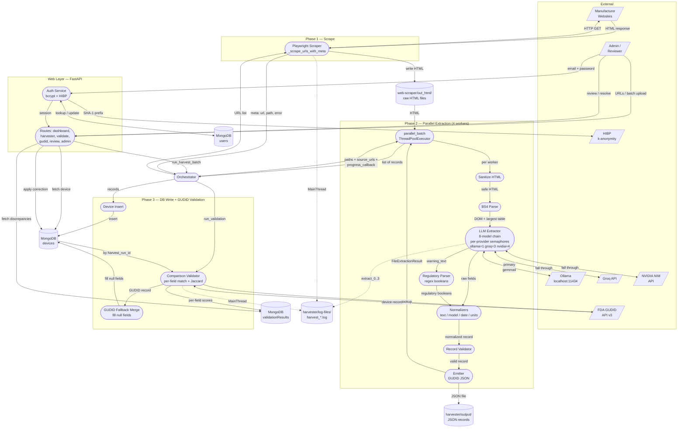

# Fivos - Data Flow Diagram

End-to-end data flow for the Fivos medical device harvester: from a user request in the web dashboard through scraping, parallel LLM extraction, normalization, GUDID validation, and human review.

## Conventions

- `/Trapezoid/` — external entities (websites, APIs, users)
- `([Stadium])` — processes (code that transforms data)
- `[(Cylinder)]` — data stores (filesystem, MongoDB collections)
- `-->` — synchronous data flow
- `-.->` — logging / side-effect flow

## End-to-End Flow

## Key flows explained

**Auth (every request).** User submits credentials to `ROUTES`. `AUTH` validates against the `users` collection using bcrypt. New passwords are checked against HIBP via client-side SHA-1 k-anonymity (only 5 hex chars leave the browser). Session cookies gate every other route; first-login accounts are forced through `/auth/change-password`.

**Phase 1 — Scrape.** `ORCH` calls `_scrape_urls_with_meta()`. Playwright fetches all URLs (internally batched with `max_concurrency=3`) and writes HTML files to `web-scraper/out_html/`. Returns per-URL metadata so failed scrapes are preserved in the results array.

**Phase 2 — Parallel extract.** `ORCH` delegates to `parallel_batch.process_html_files_parallel()` which spawns a `ThreadPoolExecutor(max_workers=4)`. Each worker reads one HTML file and runs the full pipeline: sanitize → parse → two-pass LLM extraction → regulatory parse → normalize → validate → emit. Inside `LLM`, each model attempts `sem.acquire(blocking=False)` on its provider semaphore (`ollama=1`, `groq=3`, `nvidia=4`); saturated workers fall through to the next model instead of queueing. Gemma4 stays at 1× (single GPU slot), overflow cascades to Groq → NVIDIA. Progress callback fires per completion.

**Phase 3 — DB write + validation.** All JSON records get inserted into the `devices` collection on the main thread. `COMP` then pulls devices by `harvest_run_id`, queries GUDID (search for DI → lookup by DI), compares four boolean fields plus Jaccard description similarity, writes per-device results to `validationResults`, and calls `MERGE` to backfill null device fields from the GUDID record (harvested always wins; GUDID-sourced fields tracked in `gudid_sourced_fields`).

**Review.** Reviewers pull partial-match and mismatch rows from `validationResults`, see side-by-side harvested-vs-GUDID values, and pick the correct value per field. Their choices overwrite the device document.

**Logging.** All phases log to `harvester/log-files/harvest_<timestamp>.log`. The format includes `[%(threadName)s]` — `[MainThread]` for orchestration, `[extract_0]` through `[extract_3]` for parallel workers — so interleaved lines remain readable.

## Related docs

- `docs/Fivos - Project Overview.md` — high-level project context
- `docs/superpowers/specs/2026-04-08-llm-extractor-parallelization-design.md` — parallelization design
- `docs/superpowers/specs/2026-04-04-gudid-field-expansion-design.md` — GUDID merge design
- `CLAUDE.md` — architecture and module map
